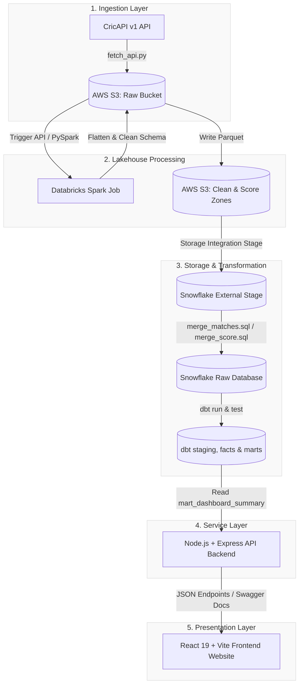

# 🏏 Real-Time Cricket Analytics & Telemetry Platform

[](https://criket-fd.vercel.app)
[](https://github.com/joyboy123-coder/dbt_cricket)
[](https://github.com/joyboy123-coder/dbt_cricket/blob/main/scripts/databricks_clean_notebook.py)
[](https://github.com/joyboy123-coder/dbt_cricket/blob/main/sql/snowflake_setup.sql)
[](https://github.com/joyboy123-coder/Criket-FD)

A premium, production-grade SaaS sports analytics platform that automates live cricket matches data ingestion, processes it on a distributed Spark cluster, builds unified data warehouse schemas with **dbt**, and serves real-time KPIs over an optimized API to a stunning glassmorphic dashboard.

---

## 🔗 Live Access & Repositories

| Component | Hosted Deployment URL | Source Code Repository |
| :--- | :--- | :--- |
| **🎨 React Frontend UI** | [criket-fd.vercel.app](https://criket-fd.vercel.app) | [joyboy123-coder/Criket-FD](https://github.com/joyboy123-coder/Criket-FD) |
| **⚙️ Node.js API Backend** | [cricket-bd.vercel.app/api-docs](https://cricket-bd.vercel.app/api-docs) | [joyboy123-coder/Cricket-BD](https://github.com/joyboy123-coder/Cricket-BD) |
| **🚀 Data Pipeline & DBT** | *Scheduled via GitHub Actions* | [joyboy123-coder/dbt_cricket](https://github.com/joyboy123-coder/dbt_cricket) |

---

## 🏗️ System Architecture & Data Telemetry Flow



---

## 🛠️ Tech Stack & Implementation Details

### 1. Ingestion & Pipeline Orchestration
* **Orchestrator**: Scheduled via a serverless **GitHub Actions** cron script ([`cricket_pipeline.yml`](file:///c:/Users/yamin/OneDrive/airflow-project/dags/dbt_cricket_project/.github/workflows/cricket_pipeline.yml)) running every 15 minutes.
* **Fallback DAGs**: Maintains two local **Airflow 2** DAG files:
  * [`cricket_api_pipeline.py`](file:///c:/Users/yamin/OneDrive/airflow-project/dags/dbt_cricket_project/cricket_api_pipeline.py) (Ingestion, S3 Key Sensor, Databricks Operator, and Snowflake load).
  * [`cricket_dbt_pipeline.py`](file:///c:/Users/yamin/OneDrive/airflow-project/dags/dbt_cricket_project/cricket_dbt_pipeline.py) (DBT compilation run & tests).
* **Ingestion Scripts**: Standalone Python scripts executing modular parts:
  * [`fetch_api.py`](file:///c:/Users/yamin/OneDrive/airflow-project/dags/dbt_cricket_project/scripts/fetch_api.py): Requests current live matches from CricAPI and stages raw JSON on S3.
  * [`trigger_databricks.py`](file:///c:/Users/yamin/OneDrive/airflow-project/dags/dbt_cricket_project/scripts/trigger_databricks.py): Calls Databricks REST endpoint and polls status.
  * [`merge_matches.py`](file:///c:/Users/yamin/OneDrive/airflow-project/dags/dbt_cricket_project/scripts/merge_matches.py) & [`merge_score.py`](file:///c:/Users/yamin/OneDrive/airflow-project/dags/dbt_cricket_project/scripts/merge_score.py): Execute Snowflake upsert operations.

### 2. Databricks PySpark Clean Job
* **Script**: [`databricks_clean_notebook.py`](file:///c:/Users/yamin/OneDrive/airflow-project/dags/dbt_cricket_project/scripts/databricks_clean_notebook.py)
* **How it cleans**:
  * Loads raw nested JSON file using multiline parser.
  * Explodes `data` matches logs and normalizes matches fields.
  * Flattens nested score arrays `match.score` into dynamic rows.
  * Cleans data types (casts Runs/Wickets to `Int`, Overs to `Double`, converts timestamps to date parameters).
  * Writes separate Matches and Scores Parquet directories back to S3.

### 3. Snowflake Storage Integration & Target Schema
* **Setup SQL**: [`snowflake_setup.sql`](file:///c:/Users/yamin/OneDrive/airflow-project/dags/dbt_cricket_project/sql/snowflake_setup.sql)
* **Storage Integration**: Secure AWS IAM Role ARN configuration granting Snowflake access to S3 bucket without keys.
* **External Stage**: `@CRICKET_STAGE` mapping directly to S3 Parquet paths.

### 4. DBT Analytical Transformation Models ([dbt_project/](file:///c:/Users/yamin/OneDrive/airflow-project/dags/dbt_cricket_project/dbt_project))
* **Staging Layer** ([`models/staging/stg_cricket_matches.sql`](file:///c:/Users/yamin/OneDrive/airflow-project/dags/dbt_cricket_project/dbt_project/models/staging/stg_cricket_matches.sql)): Deduplicates records based on `MATCH_ID` (most recent fetch dates) and casts UTC GMT to India timezone (`Asia/Kolkata`).
* **Fact Layer** ([`models/marts/fact_cricket_matches.sql`](file:///c:/Users/yamin/OneDrive/airflow-project/dags/dbt_cricket_project/dbt_project/models/marts/fact_cricket_matches.sql)): Parses raw match status string using RegExp to extract `WINNER`, `WIN_MARGIN` and outcomes (`RESULT_TYPE`).
* **Marts Layer**:
  * [`mart_matches.sql`](file:///c:/Users/yamin/OneDrive/airflow-project/dags/dbt_cricket_project/dbt_project/models/marts/mart_matches.sql): Side-by-side matches detail, runs, wickets, and overs for both teams.
  * [`mart_venue_stats.sql`](file:///c:/Users/yamin/OneDrive/airflow-project/dags/dbt_cricket_project/dbt_project/models/marts/mart_venue_stats.sql): Aggregated stadium telemetry, average runs, lat/long mapping coordinates, and flags.
  * [`mart_dashboard_summary.sql`](file:///c:/Users/yamin/OneDrive/airflow-project/dags/dbt_cricket_project/dbt_project/models/marts/mart_dashboard_summary.sql): Prepares a single row containing platform KPIs.

### 5. Node.js Service Layer (Backend)
* **Technology**: Node.js, Express, `snowflake-sdk`, Swagger OpenAPI, CORS.
* **Functionality**: Establishes connection pools to Snowflake, queries dbt-transformed tables like `MART_DASHBOARD_SUMMARY`, and maps results to optimized JSON endpoints.
* **Main Endpoint**: `GET /api/dashboard`
  ```json
  {
    "totalMatches": 11,
    "liveMatches": 2,
    "completedMatches": 7,
    "abandonedMatches": 2,
    "citiesIngested": 7,
    "venuesRegistered": 6,
    "matchFormats": 6,
    "resultDeciders": 8
  }
  ```

### 6. React Analytics Dashboard (Frontend)
* **Technology**: React 19, TypeScript, Vite 8, Framer Motion, Tailwind CSS, TanStack React Query, Axios, Apache ECharts.
* **Features**:
  * **Dashboard tab**: Glassmorphic dark widgets displaying real-time metrics dynamically loaded from Snowflake.
  * **Live Match Center tab**: Scorecards showing current innings progress.
  * **Match Explorer & Venues tabs**: Detailed visual breakdown of data.
  * **Pipeline Monitor**: Interactive logs visualizer displaying the status of S3 uploads, CricAPI, and Snowflake connections.
  * **Connection Guard**: Displays a clean reconnect UI if database connection drops.

---

## 🚀 Local Installation & Start

### 1. Ingestion Pipeline & dbt
Install Python dependencies and configure environment variables in your terminal:
```bash
cd dbt_cricket_project
pip install -r requirements.txt
```
To test individual pipeline tasks manually:
```bash
python scripts/fetch_api.py
python scripts/trigger_databricks.py
python scripts/merge_matches.py
python scripts/merge_score.py
python scripts/run_dbt.py
```

### 2. Node.js Backend API
Navigate to the backend project folder, set up your `.env` credentials, and start the node server:
```bash
cd Cricket-BD
npm install
npm run dev
```
*The API documentation page is available at `http://localhost:5000/api-docs`.*

### 3. React Frontend Website
Navigate to the frontend project folder, set up `.env`, and start the Vite app:
```bash
cd Criket-FD
npm install
npm run dev
```
*The React Dashboard UI will launch at `http://localhost:5173`.*
