# 🏏 Real-Time Cricket Analytics & Telemetry Platform

Welcome to the **Real-Time Cricket Analytics & Telemetry Platform**! This repository hosts the end-to-end serverless data engineering pipeline that pulls live match feeds, cleans them with Spark, models them in Snowflake, and serves them to a beautiful React dashboard.

---

## 🔗 Live Access Links

We have deployed the entire stack. You can access the live dashboards and code below:

* **🎨 Frontend UI Website**: [criket-fd.vercel.app](https://criket-fd.vercel.app) *(Source: [`joyboy123-coder/Criket-FD`](https://github.com/joyboy123-coder/Criket-FD))*
* **⚙️ Backend API Service**: [cricket-bd.vercel.app/api-docs](https://cricket-bd.vercel.app/api-docs) *(Source: [`joyboy123-coder/Cricket-BD`](https://github.com/joyboy123-coder/Cricket-BD))*
* **🚀 Data Ingestion & Models**: *GitHub Actions Scheduled* *(Source: [`joyboy123-coder/dbt_cricket`](https://github.com/joyboy123-coder/dbt_cricket))*

---

## 🏗️ Pipeline Architecture

Here is how the data flows from the cricket stadium to your screen:

```mermaid
flowchart LR
    %% Data flow nodes
    A(🏏 CricAPI) -->|1. fetch_api.py| B[(☁️ AWS S3 Raw)]
    B -->|2. Trigger ETL| C[🔥 Databricks Spark]
    C -->|3. Save Parquet| D[(☁️ AWS S3 Clean)]
    D -->|4. Copy Stream| E[(❄️ Snowflake DWH)]
    E -->|5. dbt run & test| F[(📊 dbt Analytics Marts)]
    F -->|6. SQL Query| G[🛡️ Node.js API]
    G -->|7. JSON Feed| H[🎨 React Dashboard]

    %% Styling colors
    style A fill:#f9d5e5,stroke:#eeeeee,stroke-width:1px
    style B fill:#eeac99,stroke:#eeeeee,stroke-width:1px
    style C fill:#e06377,stroke:#eeeeee,stroke-width:1px
    style D fill:#eeac99,stroke:#eeeeee,stroke-width:1px
    style E fill:#c83349,stroke:#eeeeee,stroke-width:1px
    style F fill:#5b9aa0,stroke:#eeeeee,stroke-width:1px
    style G fill:#d6e4e5,stroke:#eeeeee,stroke-width:1px
    style H fill:#b2d8d8,stroke:#eeeeee,stroke-width:1px
```



---

## 📁 Repository Structure

We restructured the folders to keep the code neat and professional:

* **`dbt_project/`** 📊: Contains only the DBT configuration files, macros, and SQL transformation models.
* **`airflow_dags/`** ⚙️: Contains the local Airflow DAG files for orchestration testing.
* **`scripts/`** 🐍: Contains Python automation scripts for CricAPI fetching, Databricks triggering, Snowflake loading, and DBT execution.
* **`sql/`** 🗄️: Contains Snowflake SQL files for storage integrations, stages, and raw table schemas.
* **`.github/workflows/`** 🚀: GitHub Actions workflow file that runs the pipeline serverless every 15 minutes.

---

## ⚙️ Data Ingestion Stages

### 📥 Step 1: Raw JSON Ingestion
The Python script [`fetch_api.py`](file:///c:/Users/yamin/OneDrive/airflow-project/dags/dbt_cricket_project/scripts/fetch_api.py) fetches live matches from CricAPI and uploads them directly to an S3 raw directory:
* **Storage Location**: `s3://airflowdemo1817/cricket/raw/{date}/matches.json`

### 🧹 Step 2: Databricks PySpark Clean
A distributed PySpark cluster loads the raw JSON, cleans the schema, flattens the nested innings score structures, and writes them back to S3 as Parquet tables:
* **Script**: [`databricks_clean_notebook.py`](file:///c:/Users/yamin/OneDrive/airflow-project/dags/dbt_cricket_project/scripts/databricks_clean_notebook.py)
* **Output Paths**:
  * Clean Matches: `s3://airflowdemo1817/cricket/clean/{date}/`
  * Clean Scores: `s3://airflowdemo1817/cricket/score/{date}/`

### ❄️ Step 3: Snowflake Secure Integration & Loading
We set up a secure, credentials-free connection using **Snowflake Storage Integrations** to map the S3 directory to a Snowflake External Stage:
* **Setup Script**: [`snowflake_setup.sql`](file:///c:/Users/yamin/OneDrive/airflow-project/dags/dbt_cricket_project/sql/snowflake_setup.sql)
* **Merges**: Python files ([`merge_matches.py`](file:///c:/Users/yamin/OneDrive/airflow-project/dags/dbt_cricket_project/scripts/merge_matches.py) and [`merge_score.py`](file:///c:/Users/yamin/OneDrive/airflow-project/dags/dbt_cricket_project/scripts/merge_score.py)) use Snowflake SQL `MERGE INTO` to copy the staged Parquet records into active tables.

---

## 📊 Analytical DBT Models ([dbt_project/](file:///c:/Users/yamin/OneDrive/airflow-project/dags/dbt_cricket_project/dbt_project))

dbt transforms raw records in Snowflake through three clean stages:

1. **Staging** 📁 (`stg_cricket_matches.sql`): Deduplicates match records using row numbers and converts timestamps from UTC to India Timezone (`Asia/Kolkata`).
2. **Facts** 📊 (`fact_cricket_matches.sql`, `fact_match_score.sql`):
   * Maps statuses using strict logic rules:
     * **Match Tied**: Classified as `Match Tied` (e.g. Lancashire vs Derbyshire).
     * **No Result**: Classified as `No Result` (e.g. Hubli Tigers vs Mysore Warriors).
     * **Abandoned**: Classified as `Abandoned` (when no ball is bowled).
     * **Completed / Live**: Classified as `Completed` or `Live`.
3. **Marts** 📈 (`mart_matches.sql`, `mart_venue_stats.sql`, `mart_dashboard_summary.sql`):
   * Aggregates venue statistics, flag codes, geolocation coordinates, and overall KPI metrics.

---

## 🎨 UI Dashboard Website & Backend Server

* **Express Backend ([Cricket-BD](file:///c:/Users/yamin/OneDrive/my%20projects/Cricket-BD))**: 
  * Connects to Snowflake using the `snowflake-sdk`.
  * Exposes the endpoints like `GET /api/dashboard` which queries the DBT mart table `MART_DASHBOARD_SUMMARY`.
  * Integrates Swagger OpenAPI interactive documentation for developer tests.
* **React Dashboard ([Criket-FD](file:///c:/Users/yamin/OneDrive/my%20projects/Criket-FD))**:
  * Built using **React 19**, **Vite 8**, **Tailwind CSS**, and **Framer Motion** (for smooth glassmorphic interface micro-animations).
  * Uses **TanStack React Query** for robust network requests, polling, and auto-retries on database offline warnings.
  * Embeds **Apache ECharts** for premium, clean sports charts and data visualizations.

---

## 🚀 Local Execution Guide

### 1. Ingestion Pipeline & dbt
Install Python dependencies and execute scripts in order:
```bash
cd dbt_cricket_project
pip install -r requirements.txt

# Execute steps manually
python scripts/fetch_api.py
python scripts/trigger_databricks.py
python scripts/merge_matches.py
python scripts/merge_score.py
python scripts/run_dbt.py
```

### 2. Node.js Backend API
Navigate to the backend directory, configure `.env` variables, and start development mode:
```bash
cd Cricket-BD
npm install
npm run dev
```

### 3. React Frontend Website
Navigate to the frontend directory, configure `.env` endpoints, and run Vite dev server:
```bash
cd Criket-FD
npm install
npm run dev
```
Vite will launch the dashboard on `http://localhost:5173`.
