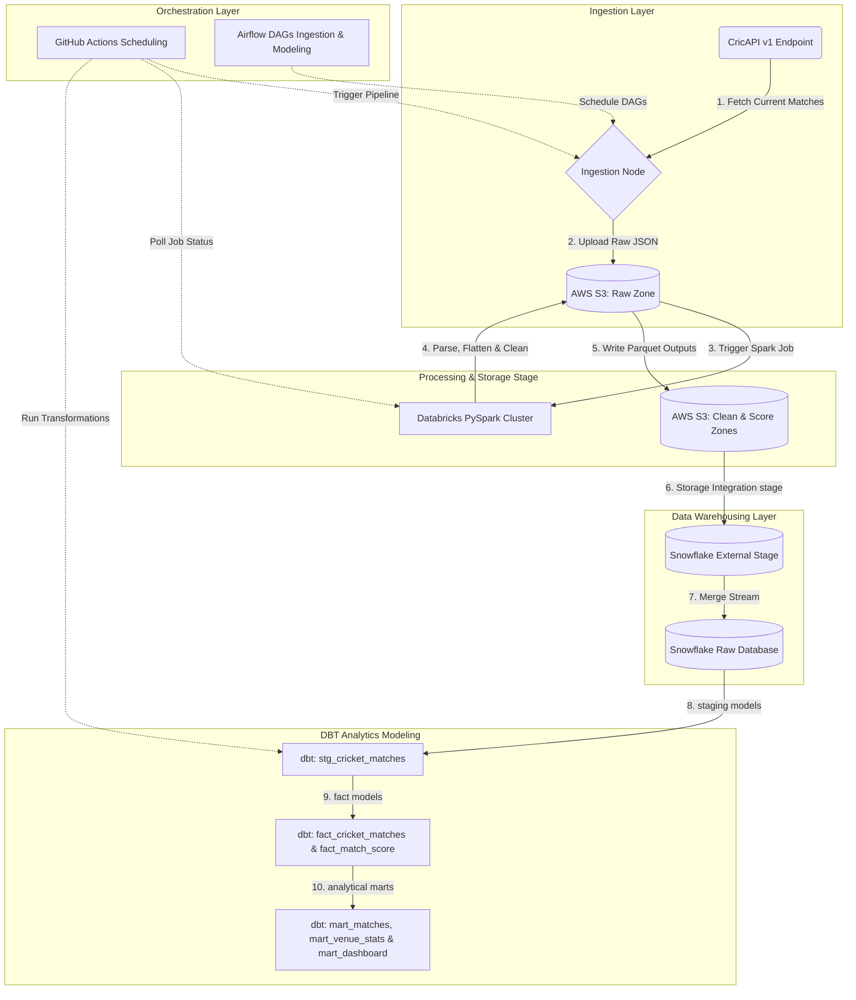

# Cricket Live Score Data Engineering Pipeline

An end-to-end, production-grade data engineering pipeline that fetches live cricket matches and score details from CricAPI, orchestrates ingestion, loads raw files into an AWS S3 Data Lake, processes and cleans the nested JSON structures using Databricks Spark, loads staging files into Snowflake, and performs analytical data modeling using DBT Core.

Originally designed as a dual-DAG Apache Airflow pipeline, this architecture has been enhanced into a serverless GitHub Actions scheduling model, providing high availability and removing server management overhead.

---

## 🏗️ Architecture Design & Data Flow



---

## 📂 Project Directory Structure

```text
dbt_cricket_project/
├── .github/
│   └── workflows/
│       └── cricket_pipeline.yml  # GitHub Actions serverless cron schedule (runs every 15 mins)
├── scripts/
│   ├── fetch_api.py              # CricAPI live-fetch script and S3 raw loader
│   ├── trigger_databricks.py     # API client triggering & polling Databricks cluster jobs
│   ├── databricks_clean_notebook.py # [NEW] Databricks Spark notebook code for JSON cleaning
│   ├── merge_matches.py          # Python Snowflake connector running matches merge statement
│   ├── merge_score.py            # Python Snowflake connector running score merge statement
│   └── run_dbt.py                # Shell runner for DBT compilation, execution, and testing
├── sql/
│   ├── snowflake_setup.sql       # [NEW] Storage Integration, External Stage, Format & Target Table SQLs
│   ├── merge_matches.sql         # SQL MERGE statement for raw Matches
│   └── merge_score.sql           # SQL MERGE statement for raw Score
├── models/
│   ├── sources.yml               # DBT raw sources definitions (CRICKET_DB.CRICKET_SCHEMA)
│   ├── staging/
│   │   ├── schema.yml            # Staging schema definitions and validation rules
│   │   └── stg_cricket_matches.sql # Match deduplication and timezone converter
│   └── marts/
│       ├── fact_cricket_matches.sql # Matches facts: Winner, Win Margins, Result Type
│       ├── fact_match_score.sql     # Score facts: Innings descriptions, Run rates, Score joins
│       ├── mart_dashboard_summary.sql # Mart table for KPI metric summary dashboards
│       ├── mart_matches.sql         # Consolidated matches with scores for both teams
│       └── mart_venue_stats.sql     # Location stats (Lat/Long, Country flags, venue history)
├── dbt_project.yml               # DBT project configuration file
├── requirements.txt              # Pipeline dependencies (boto3, requests, snowflake-connector)
└── README.md                     # Documentation and setup instructions
```

---

## 🔗 Storage Integration & Snowflake Stage Setup

The pipeline uses **Snowflake Storage Integration** to establish a secure, credentials-free connection between Snowflake and AWS S3. 

1. **Storage Integration**: A secure object that stores an AWS IAM Role ARN, mapping it internally to a Snowflake-managed AWS IAM User.
2. **External Stage**: References the S3 directory path through the Storage Integration using a defined **Parquet File Format**.

The SQL instructions used to provision these components are located in [`sql/snowflake_setup.sql`](file:///c:/Users/yamin/OneDrive/airflow-project/dags/dbt_cricket_project/sql/snowflake_setup.sql):

```sql
-- Create Secure Integration
CREATE OR REPLACE STORAGE INTEGRATION s3_cricket_integration
  TYPE = EXTERNAL_STAGE
  STORAGE_PROVIDER = 'S3'
  ENABLED = TRUE
  STORAGE_ALLOWED_LOCATIONS = ('s3://airflowdemo1817/')
  STORAGE_AWS_ROLE_ARN = 'arn:aws:iam::123456789012:role/SnowflakeS3AccessRole';

-- Create Stage mapping S3 clean outputs
CREATE OR REPLACE STAGE CRICKET_STAGE
  URL = 's3://airflowdemo1817/cricket/'
  STORAGE_INTEGRATION = s3_cricket_integration
  FILE_FORMAT = (TYPE = 'PARQUET' COMPRESSION = 'SNAPPY');
```

---

## ⚡ Databricks Spark Cleaning & Parsing Layer

Because live API results from CricAPI arrive in nested JSON format with variable configurations (e.g. nested match info arrays, sub-arrays of scoreboard inning entries), we use a distributed Spark job on Databricks to execute schema validation and data flattening.

The PySpark notebook script is stored at [`scripts/databricks_clean_notebook.py`](file:///c:/Users/yamin/OneDrive/airflow-project/dags/dbt_cricket_project/scripts/databricks_clean_notebook.py):

* **JSON Explosion**: Flattens nested matches under `data`.
* **Sub-array Flattening**: Explodes scoring logs (`match.score`) to normalize running scores, runs, wickets, and overs.
* **Casting & Timezone Isolation**: Standardizes date strings, timestamp zones, and casts integer/float fields (Runs, Wickets, Overs).
* **Parquet Serialization**: Overwrites partitioned Parquet directories (`cricket/clean/{date}/` and `cricket/score/{date}/`) back to S3.

---

## 🔀 Airflow Orchestration (2 Dual-DAG Pipelines)

For local deployments and test orchestrations, the project maintains **two core Airflow pipelines** under the DAGs folder:

### 1. Ingestion & Snowflake Load DAG (`cricket_api_pipeline`)
Orchestrates raw API scraping, data staging validation, Spark cluster triggers, and Snowflake loads:
* **`fetch_api_task`** (`PythonOperator`): Invokes CricAPI, fetches current active matches, and saves raw payload JSON into S3.
* **`wait_for_cricket_file`** (`S3KeySensor`): Monitors S3, polling every 60 seconds until the API payload exists in the raw partition.
* **`run_databricks_clean`** (`DatabricksRunNowOperator`): Connects to Databricks API, invokes the cleaning job on the cluster, and monitors the run status.
* **`load_matches_to_snowflake`** & **`load_score_to_snowflake`** (`SQLExecuteQueryOperator`): Run raw SQL commands (`merge_matches.sql`, `merge_score.sql`) using Snowflake Connector to upsert the newly created S3 Parquet tables.

### 2. DBT Transformations DAG (`cricket_dbt_pipeline`)
Runs scheduled DBT transforms after ingestion completes:
* **`dbt_run`** (`BashOperator`): Executes `dbt run` inside the project folder, creating structural models in Snowflake.
* **`dbt_test`** (`BashOperator`): Executes `dbt test` to run data quality, constraint checks, null checks, and key constraints.

---

## 🔄 Serverless GitHub Actions Migration

To transition this architecture to a fully managed serverless structure, the file [`.github/workflows/cricket_pipeline.yml`](file:///c:/Users/yamin/OneDrive/airflow-project/dags/dbt_cricket_project/.github/workflows/cricket_pipeline.yml) manages the scheduling:
1. **GitHub Runner Setup**: Installs python environment, checks out code, and installs libraries.
2. **fetch_api.py**: Pulls JSON and writes directly to S3.
3. **trigger_databricks.py**: Calls Databricks Jobs API endpoint `jobs/run-now`, polling the run-id until the cluster job exits successfully.
4. **merge_matches.py** & **merge_score.py**: Connect to Snowflake to run transaction merges.
5. **run_dbt.py**: Generates local profile structure and runs DBT compile, models, and validations.

---

## 📊 Analytical DBT Models Walkthrough

Once data is merged into the warehouse tables (`CRICKET_MATCHES` and `CRICKET_SCORE`), DBT transforms it through a three-stage layout:

### 1. Staging (`staging/stg_cricket_matches.sql`)
* Removes duplicates using a window partition partition over `MATCH_ID` sorted by `FETCH_DATE DESC`.
* Casts timestamps from UTC to **Asia/Kolkata** (IST) and extracts match dates and start times.

### 2. Facts (`marts/fact_cricket_matches.sql` and `marts/fact_match_score.sql`)
* **`fact_cricket_matches`**: Parses the raw unstructured string `STATUS` (e.g. *"India won by 6 wickets"*, *"Super Over won by Australia"*) using regular expressions to extract clean `WINNER`, `RESULT_TYPE` (Completed, Live, Abandoned, Outdated), and `WIN_MARGIN` attributes.
* **`fact_match_score`**: Maps the numeric innings indicators (1, 2, 3, 4) into standard match phases (*1st Innings*, *2nd Innings*), concatenates scores (`Runs/Wickets`), and calculates individual innings run rates.

### 3. Marts (`marts/mart_matches.sql`, `marts/mart_venue_stats.sql`, `marts/mart_dashboard_summary.sql`)
* **`mart_matches`**: Consolidates matches by grouping scores from both Team 1 and Team 2, showing side-by-side run statistics, total overs, run rates, and the overall active status of the match.
* **`mart_venue_stats`**: Generates stadium metadata. Groups matches played per venue, records average first and second innings scores, maps cities to countries and flags, and includes Geolocation Latitude & Longitude values.
* **`mart_dashboard_summary`**: Aggregate KPI table detailing overall matches, live matches count, completed games, cities, venues, and match format counts.

---

## 🚀 Setting Up the New GitHub Repository

To upload this complete, self-contained project codebase to a new GitHub repository, run the following commands:

```bash
# Navigate to project directory
cd dbt_cricket_project

# Initialize local git repository
git init

# Stage all files
git add .

# Create initial commit
git commit -m "feat: Add Databricks ETL, Snowflake Storage Integration, and DBT models"

# Create a main branch
git branch -M main

# Link to your new GitHub repository (replace with your repository url)
git remote add origin https://github.com/<your-username>/<your-new-repo>.git

# Push changes to GitHub
git push -u origin main
```
Ensure that you configure the **Repository Secrets** in your GitHub repository settings as detailed in the deployment section of this README to allow the GitHub Actions scheduling to execute.
